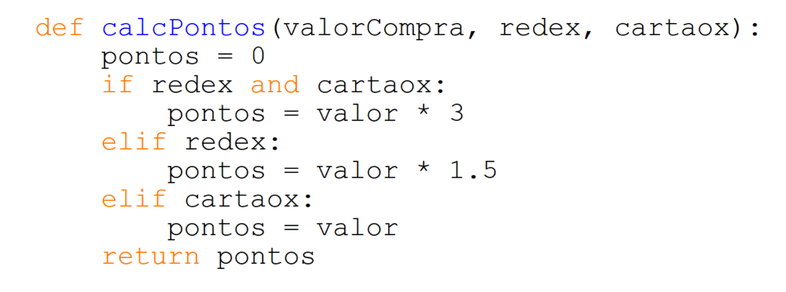
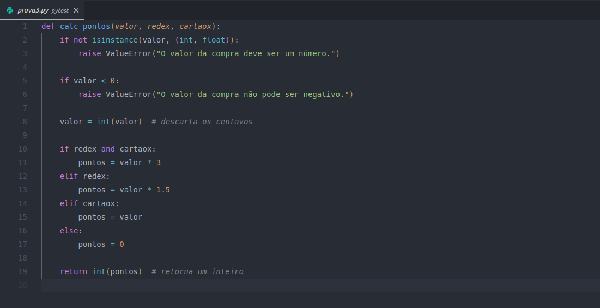
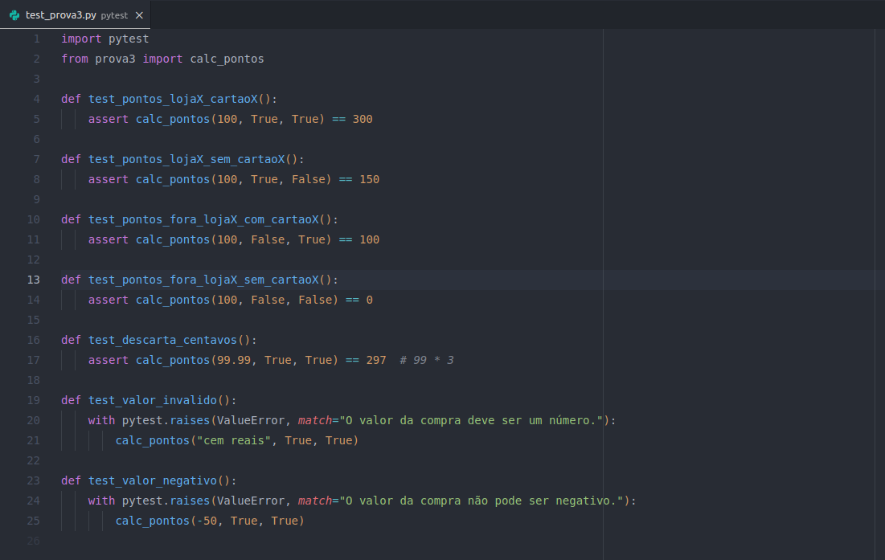
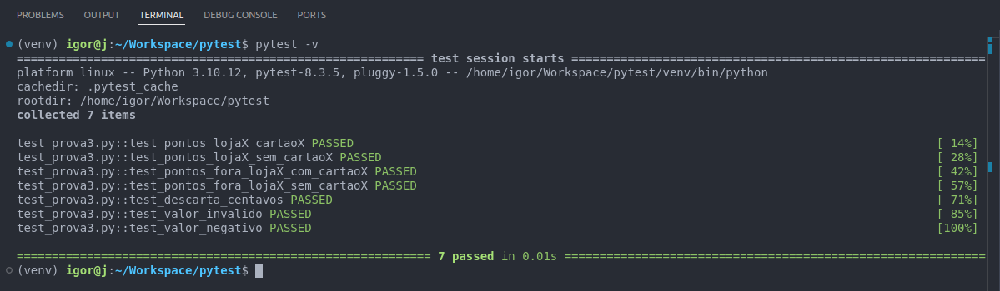

# Cálculo de Pontos do Programa de Fidelidade

Este repositório implementa uma função para calcular pontos de um programa de fidelidade baseado no valor da compra, na forma de pagamento e no local da compra.

> ⚠️ AVISO: Todos os comandos utilizados e testes feitos neste repositório foram realizados em uma distribuição Linux Ubuntu.

## 1. Código Fornecido
O código fornecido apresentava alguns problemas, como:
- Uso incorreto do nome da variável `valor` (deveria ser `valor_compra`).
- Falta de tratamento para valores negativos.
- Consideração de centavos na pontuação.



## 2. Código Corrigido
O código foi ajustado para garantir a validação das entradas e para descartar os centavos do valor da compra.



## 3. Testes com Pytest
Para garantir a funcionalidade correta da função, foram implementados testes utilizando o `pytest`.



## 4. Como Executar os Testes
Para rodar os testes, basta instalar o `pytest` e executar o seguinte comando:

```bash
pip install pytest
pytest -v
```

depois de executar os comandos acima você deverá obter um resultado como esse:




## Aproveite este repositório!

Criado por **João Igor dos Santos Barbosa**.

[](https://github.com/ignizxl)